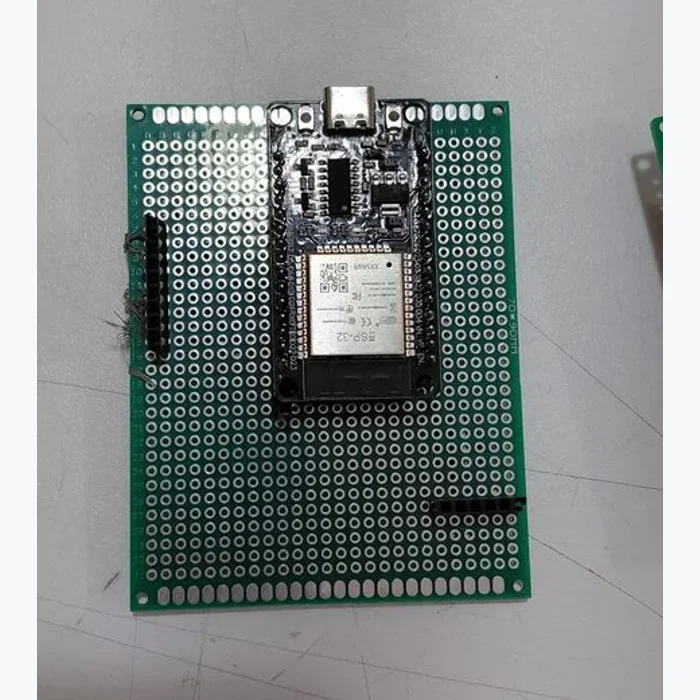
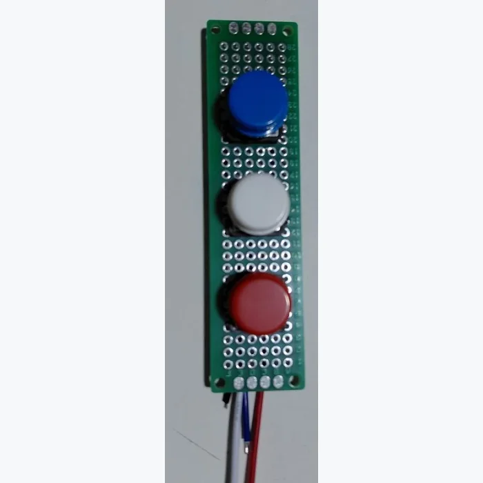

# Analysis Terminal

> An ESP32 terminal with a colour screen and physical buttons for exploring Think to Ink team scores and standings.

  
  

**[Open the companion page](https://analysis-terminal.daeda-technologies.workers.dev/)**

## What it does

Enter your player ID on your phone to send a team to the terminal. Browse the score, rank, games played, wins and league standings on its 320 x 240 display.

| Button | Action |
| --- | --- |
| Blue - Previous | Previous page |
| White - Next | Next page |
| Red - Reset | Finish the session and return to the demo |

The idle screen uses clearly labelled fictional demo data. Team sessions last up to 15 minutes; unavailable values show N/A.

Hardware by **TikitaTech**. [Think to Ink](https://thinkapp.net/ink/) / Ministry of Artificial game by **Leon Brown**.

## Bill of materials

| Qty | Part | Unit cost |
| --- | --- | ---: |
| 1 | ESP32-WROOM development board, 30-pin USB-C | £4.66 |
| 1 | 2.8-inch ILI9341 SPI TFT | £8.99 |
| 3 | Momentary buttons: blue, white, red | Included in starter kit |
| 1 each | 70 x 90 mm and 20 x 80 mm perfboard | Shared stock |
| 2 | Female socket header strips, cut to 15 contacts | £0.10 per strip |
| As needed | Male headers, jumpers, hook-up wire and solder | Shared supplies |
| 1 | NTAG213 NFC sticker for the companion link | £0.17 |
| 1 | USB-C data cable and USB power supply | Already owned |
| 1 set | Printed enclosure | Cost not recorded |

Prices are per part where recorded. The NFC sticker opens a link on a phone; it is not wired to the ESP32.

## Wiring

Power the ESP32 by USB. All grounds are shared.

| TFT connection | ESP32 pin |
| --- | --- |
| VCC | VIN (USB 5 V supply) |
| GND | GND |
| LED / backlight | 3V3 |
| CS | GPIO33 |
| RESET | GPIO22 |
| DC | GPIO21 |
| MOSI / SDI | GPIO23 |
| SCK | GPIO18 |

| Button | ESP32 pin | Other contact |
| --- | --- | --- |
| Previous | GPIO25 | GND |
| Next | GPIO26 | GND |
| Reset | GPIO32 | GND |

Buttons use internal pull-ups. TFT MISO, touch and SD connections are unused. The supply wiring above is for the DollaTek ILI9341 module used here.

## Firmware

1. Install the ESP32 board package, **Adafruit ILI9341** and **ArduinoJson 7** in Arduino IDE.
2. Copy [main/secrets.example.h](main/secrets.example.h) to `main/secrets.h`.
3. Set your 2.4 GHz Wi-Fi, Worker URL and device key.
4. Open [main/main.ino](main/main.ino), select **ESP32 Dev Module** and your port, then upload.
5. Open Serial Monitor at **115200 baud**.

The device key must match your companion app. [Firmware details](main/README.md).

## Companion app

A React app and Cloudflare Worker connect the phone, game API and ESP32. D1 stores one active terminal session.

**[Setup and development](app/README.md)** includes database setup and a computer-only simulator. The simulator acts as the terminal, so run one device at a time.

## Enclosure

The housing holds the screen, main board and three-button strip, with USB access and a recess for the NFC sticker.

## This project elsewhere

| Where | Link |
| --- | --- |
| Companion | [Send your player ID](https://analysis-terminal.daeda-technologies.workers.dev/) |
| Game | [Think to Ink](https://thinkapp.net/ink/) |
| Game API | [Documentation](https://thinkapp.net/ink/api.html) |
| Portfolio | [TikitaTech](https://tikitatech.xyz/) |
| YouTube | [TikitaTech builds](https://www.youtube.com/@tikitatech) |

## Licence

Original project code and documentation: [MIT](LICENSE). Think to Ink and Ministry of Artificial belong to their respective creators.
