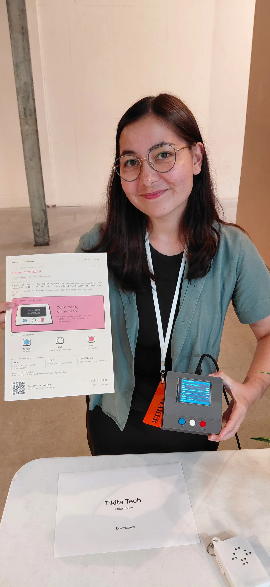
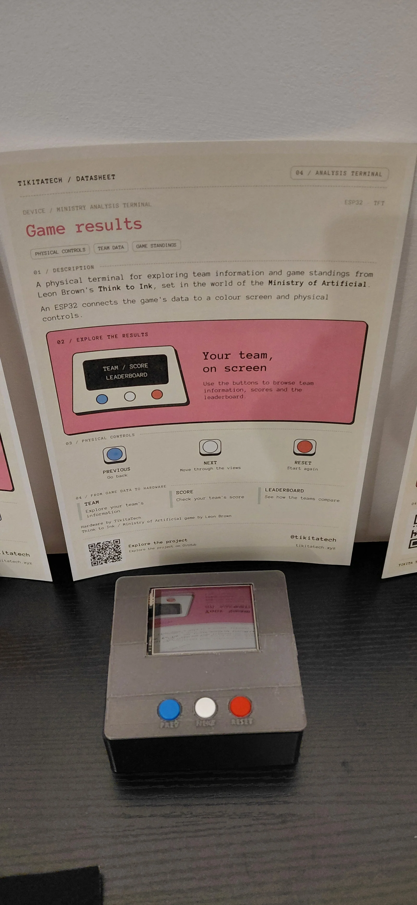

# Analysis Terminal

> A physical ESP32 game module with a colour screen and buttons for exploring team scores and standings.

  
  

**[Open the companion page](https://analysis-terminal.daeda-technologies.workers.dev/)**

## What it does

The Analysis Terminal is a physical ESP32 game module built for Think to Ink. Enter a player ID on a phone to send the corresponding team to the terminal, then browse score, rank, games played, wins and league standings on its 320 x 240 colour display.

| Button | Action |
| --- | --- |
| Blue - Previous | Previous result view |
| White - Next | Next result view |
| Red - Reset | Finish the session and return to the demo |

The idle screen uses clearly labelled fictional demo data. Team sessions last up to 15 minutes and unavailable values show N/A.

Built and exhibited at Liverpool MakeFest 2026. Think to Ink and Ministry of Artificial belong to Leon Brown and their respective creators.

## Bill of materials

| Qty | Part | Project cost |
| --- | --- | ---: |
| 1 | ESP32-WROOM development board, 30-pin USB-C | £4.66 |
| 1 | 2.8-inch ILI9341 SPI TFT | £8.99 |
| 3 | Momentary buttons: blue, white, red | Shared starter kit |
| 1 each | 70 x 90 mm and 20 x 80 mm perfboard | £1.79 |
| 2 | Female socket header strips, cut to 15 contacts | £0.20 |
| As needed | Male headers, jumpers, hook-up wire and solder | Shared supplies |
| 1 | NTAG213 NFC sticker for the companion link | £0.17 |
| 1 | USB-C data cable and USB power supply | Already owned |
| 1 set | 89.05 g black and grey PETG enclosure | £3.12 |
| | **Project-specific materials** | **£18.93** |

The NFC sticker opens the companion page on a phone. It is not wired to the ESP32.

## Wiring

Power the ESP32 by USB. All grounds are shared.

| TFT connection | ESP32 pin |
| --- | --- |
| VCC | VIN, USB 5 V supply |
| GND | GND |
| LED / backlight | 3V3 |
| CS | GPIO33 |
| RESET | GPIO22 |
| DC | GPIO21 |
| MOSI / SDI | GPIO23 |
| SCK | GPIO18 |

| Button | ESP32 pin | Other contact |
| --- | --- | --- |
| Previous | GPIO25 | GND |
| Next | GPIO26 | GND |
| Reset | GPIO32 | GND |

Buttons use internal pull-ups. TFT MISO, touch and SD connections are unused. The supply wiring above is for the DollaTek ILI9341 module used here.

## Firmware

1. Install the ESP32 board package, **Adafruit ILI9341** and **ArduinoJson 7** in Arduino IDE.
2. Copy [main/secrets.example.h](main/secrets.example.h) to `main/secrets.h`.
3. Set your 2.4 GHz Wi-Fi, Worker URL and device key.
4. Open [main/main.ino](main/main.ino), select **ESP32 Dev Module** and your port, then upload.
5. Open Serial Monitor at **115200 baud**.

The device key must match your companion app. See the [firmware details](main/README.md).

## Companion app

A React app and Cloudflare Worker connect the phone, game data and ESP32. D1 stores one active terminal session.

The [setup and development guide](app/README.md) includes database setup and a computer-only simulator. The simulator acts as the terminal, so run one device at a time.

## Enclosure

The two-part black and grey PETG housing measures 114 x 110 x 44 mm. It holds the 2.8-inch display, soldered main board and separate three-button board, with USB access and a recess for the NFC sticker.

The finished base uses 66.69 g of black PETG and the lid uses 22.36 g of grey PETG. The design history is available in [Onshape](https://cad.onshape.com/documents/d6ec5f2dd0951a1b7355f470/w/5b63cb991f0fe80530b211b7/e/640922f56b5b1f5cced2886b).

## Inside the build

  
  

## This project elsewhere

| Where | Link |
| --- | --- |
| Portfolio | [Analysis Terminal](https://tikitatech.xyz/projects/analysis-terminal/) |
| Companion | [Send a player ID](https://analysis-terminal.daeda-technologies.workers.dev/) |
| CAD | [Onshape design history](https://cad.onshape.com/documents/d6ec5f2dd0951a1b7355f470/w/5b63cb991f0fe80530b211b7/e/640922f56b5b1f5cced2886b) |
| YouTube | [Liverpool MakeFest 2026 walkthrough](https://www.youtube.com/shorts/vc8HpOMW9wA) |

## Licence

The software and firmware are available under the [MIT License](LICENSE).

The original enclosure design, build documentation and deliberately released project photographs are available under [CC BY-NC-SA 4.0](LICENSE-DESIGN.md).
